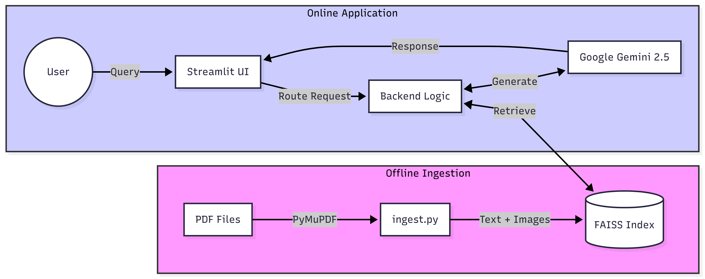

# 🧠 Insight Engine AI
### Multimodal RAG System with Cognitive Agentic Workflows


**Insight Engine** is an advanced **Retrieval-Augmented Generation (RAG)** system designed to analyze complex technical documents (PDFs). Unlike standard RAGs, it features a dual-mode cognitive architecture: a high-speed **Simple Mode** for direct queries and an agentic **Complex Mode** for tasks requiring synthesis, comparative analysis, and architectural design.

---

## ✨ Key Features

| Feature | Description |
| :--- | :--- |
| **🧠 Dual-Mode Routing** | Automatically detects intent. "Design/Universal" triggers the **Complex Agent**, while standard queries use **Fast Retrieval**. |
| **👁️ Multimodal Context** | Retrieves not just text but **visual snapshots** (2x zoom PNGs) of the original paper to give the AI "eyes." |
| **🕸️ Hybrid Search** | Combines **Vector Similarity (FAISS)** with a hardcoded **Knowledge Graph** and **Concept Map** for higher accuracy. |
| **📉 Smart Backoff** | Custom resilience logic handles API Rate Limits (429 Errors) by automatically pausing and retrying. |
| **📊 Auto-Visualization** | Automatically generates **Mermaid.js** architecture diagrams and comparative tables for design queries. |

---


## Quick Links

- **Source:** `src/`
- **Ingest script:** `src/ingest.py`
- **App entry:** `src/app.py`
- **Config:** `src/config.py`

---

## Installation

Prerequisites: Python 3.10+ and `git`.

1. Clone or open the repository:

```bash
git clone <your-repo-url>
cd Insight_Engine
```

2. Create and activate a virtual environment (recommended):

```bash
python3 -m venv .venv
source .venv/bin/activate
```

3. Install Python dependencies:

```bash
pip install -r requirements.txt
```

4. Create a `.env` file in the project root. The project requires at least the
following environment variable (see `src/config.py`):

```ini
GOOGLE_API_KEY=your_gemini_api_key_here
```

`src/config.py` will raise an error if `GOOGLE_API_KEY` is missing.

---

## Ingest data (build the vector store)

1. Put your PDF files into the `data/` folder.
2. Run the ingestion script to extract text, page images, and build the FAISS
	 index:

```bash
python src/ingest.py
```

This will populate `storage/faiss_index/` and `storage/page_images/`.

---

## Run the app

```bash
streamlit run src/app.py
```

Open http://localhost:8501 in your browser.

---

## 📐 System Architecture

### 1. High-Level Data Flow
The system bridges offline data ingestion with a real-time reactive UI.


### 2. Advanced Cognitive Logic
A deep dive into the routing logic, scoring algorithms, and agentic decomposition loops.


---

## Usage

- Simple Mode: ask concise questions for fast retrieval answers.
- Complex Mode: ask design or comparative questions to trigger agentic
	decomposition, multi-source retrieval, synthesis, and diagram generation.

---


## Features

- Dual `Simple` and `Complex` routing for short answers vs agentic workflows.
- Multimodal context with extracted page images for visual grounding.
- Hybrid retrieval using FAISS vectors plus concept maps / knowledge graph.
- Smart backoff and retry for API rate limits.
- Automatic diagram generation (Mermaid) for design queries.

---

## Tech stack

- LLM: Google Gemini (via LangChain integration)
- Vector DB: FAISS
- Embeddings: `sentence-transformers/all-MiniLM-L6-v2`
- PDF processing: PyMuPDF (fitz)
- UI: Streamlit

---


## 🛠️ Project Structure

```
INSIGHT_ENGINE/
├── assets/                  # Architecture diagrams and screenshots
├── data/                    # Place your 50+ PDF research papers here
├── src/
│   ├── app.py               # Frontend: Streamlit UI & Session Management
│   ├── backend.py           # Brain: Retrieval, Reasoning & Agent Logic
│   ├── config.py            # Settings: Paths, Keys & Model Params
│   └── ingest.py            # ETL: PDF processing, Image extraction & Vectorization
├── storage/
│   ├── faiss_index/         # The persistent Vector Database
│   └── page_images/         # Extracted high-res images for Multimodal RAG
├── .env                     # API Keys (Not shared)
├── requirements.txt         # Python dependencies
└── README.md                # Documentation
```

---